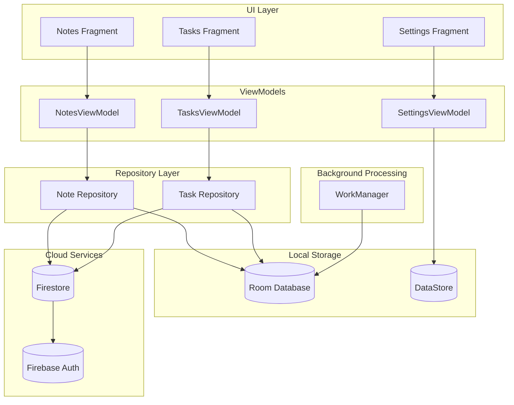

# 🚀 KNotes: Premium Productivity Ecosystem

<div align="center">

[](https://kotlinlang.org)
[](https://m3.material.io)
[]()
[](https://www.android.com)

### ✨ AI-Powered Note Taking • Material 3 Design • Modern Productivity

KNotes is a premium Android productivity suite built with **Kotlin**, **Material 3**, and **Clean Architecture**. Designed to help users capture ideas, manage tasks, organize knowledge, and streamline workflows with a beautiful and responsive user experience.

</div>

---

## 🎨 Design Philosophy

KNotes embraces the principles of **Material You**, delivering a personalized and delightful user experience.

### 🌈 Modern UI Experience

* Material 3 dynamic theming
* Adaptive layouts for different screen sizes
* Elegant typography and spacing
* Light & Dark theme support

### ✨ Motion & Interactions

* Smooth Material Motion transitions
* Delightful micro-interactions
* Fluid list and grid animations
* Responsive touch feedback

### 🎯 Productivity First

* Fast note creation and editing
* Minimal distractions
* Organized information hierarchy
* Optimized workflows

---

## 📸 App Preview

<div align="center">

<table>
<tr>
<td align="center">
<br/>
<b>Notes Dashboard</b>
</td>

<td align="center">
<br/>
<b>Rich Note Editor</b>
</td>

<td align="center">
<br/>
<b>Task Management</b>
</td>
</tr>
</table>

</div>

<p align="center">
<i>Beautiful • Fast • Intelligent</i>
</p>

---

## 🌟 Key Features

### 📝 Smart Note Management

* Create, edit, and organize notes effortlessly
* Pin important notes for quick access
* Mark favorites for better organization
* Archive notes without deleting them
* Intelligent search and filtering

### 🗑️ Advanced Recovery System

* Dedicated trash management
* 30-day automatic recovery window
* Scheduled cleanup using WorkManager
* Protection against accidental deletion

### 🤖 AI Assistant

* Auto-summarization of long notes
* Intelligent title generation
* Task extraction from content
* Context-aware productivity suggestions

### ⚡ Powerful Writing Experience

* Markdown support with live rendering
* Rich formatting toolbar
* Voice-to-text note creation
* Fast and distraction-free editor

### 🔒 Security & Privacy

* Biometric authentication support
* Encrypted local storage
* Secure preference management
* User-focused privacy controls

### ☁️ Cloud Sync

* Firebase Authentication
* Firestore cloud synchronization
* Cross-device accessibility
* Secure cloud backup

---

## 🛠 Tech Stack

| Layer                | Technology                        |
| -------------------- | --------------------------------- |
| Language             | Kotlin                            |
| Architecture         | MVVM + Clean Architecture         |
| Dependency Injection | Hilt                              |
| Database             | Room                              |
| Cloud Services       | Firebase Auth + Firestore         |
| Background Tasks     | WorkManager                       |
| Preferences          | DataStore                         |
| UI Framework         | Material 3 + ViewBinding          |
| Security             | BiometricPrompt + Security Crypto |
| Markdown Rendering   | Markwon                           |
| Navigation           | Jetpack Navigation                |
| Lifecycle            | AndroidX Lifecycle Components     |

---

## 📐 Architecture Overview

KNotes follows a scalable architecture based on **MVVM**, **Repository Pattern**, and **Single Source of Truth** principles.



---

## 📂 Project Structure

```text
KNotes/
├── app/
│
├── data/
│   ├── dao/
│   ├── database/
│   ├── entity/
│   └── model/
│
├── repository/
│
├── di/
│
├── ui/
│   ├── notes/
│   ├── tasks/
│   ├── settings/
│   └── shared/
│
├── util/
│
├── worker/
│
├── build.gradle.kts
└── libs.versions.toml
```

---

## 🚀 Getting Started

### 1️⃣ Clone Repository

```bash
git clone https://github.com/akashray398/KNotes-App.git
```

### 2️⃣ Open in Android Studio

Open the project using the latest stable version of Android Studio.

### 3️⃣ Sync Dependencies

Allow Gradle to download and configure all required dependencies.

### 4️⃣ Run Application

Connect an Android device or emulator running Android 8.0 (API 26) or higher.

---

## 📋 Requirements

| Requirement    | Version           |
| -------------- | ----------------- |
| Android Studio | Latest Stable     |
| Minimum SDK    | 26                |
| Target SDK     | 36                |
| Kotlin         | 2.0.21            |
| Gradle         | Latest Compatible |

---

## 🗺️ Future Roadmap

* [ ] AI note categorization
* [ ] AI-powered chat assistant
* [ ] Collaborative notes
* [ ] Rich text editor
* [ ] Calendar integration
* [ ] Note sharing system
* [ ] Wear OS support
* [ ] Tablet optimized layouts

---

## 🤝 Contributing

Contributions are welcome and greatly appreciated.

1. Fork the repository
2. Create your feature branch

```bash
git checkout -b feature/amazing-feature
```

3. Commit your changes

```bash
git commit -m "Add amazing feature"
```

4. Push to GitHub

```bash
git push origin feature/amazing-feature
```

5. Open a Pull Request

---

## 📜 License

This project is licensed under the MIT License.

See the `LICENSE` file for details.

---

<div align="center">

### ⭐ If you like KNotes, consider giving it a star!

Made with ❤️ by **Akash**

</div>
