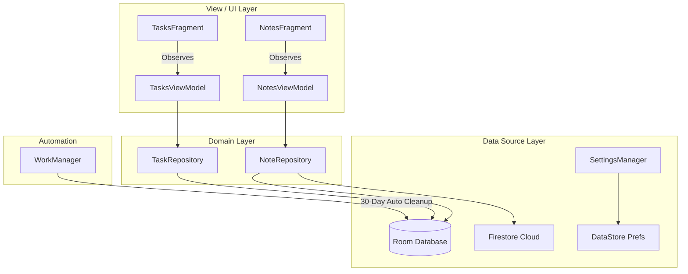

# 🚀 KNotes: Premium Productivity Ecosystem

[](https://kotlinlang.org)
[](https://m3.material.io)
[]()
[](https://www.android.com)

**KNotes** is not just another note-taking application; it is a high-performance, premium productivity suite designed for modern Android users. Built with an uncompromising focus on **Material 3 Motion Design**, **AI-Assisted Workflows**, and **Robust Architectural Patterns**, KNotes bridges the gap between simple capture tools and complex knowledge management systems like Notion and Evernote.

---

## 🎨 Design Philosophy
KNotes follows the **Material You** guidelines, emphasizing personalization and fluidity.
- **Micro-Interactions**: Every swipe, tap, and scroll is accompanied by smooth Material Motion transitions.
- **Glassmorphism & Depth**: Subtle radial gradients and elevation cards create a 3D depth effect.
- **Adaptive Layouts**: Seamlessly transitions between list and grid views with optimized spacing.

---

## 🛠 Tech Stack & Modern Tools

| Layer | Technologies                                                  |
| :--- |:--------------------------------------------------------------|
| **Language** | Kotlin                                                        |
| **Dependency Injection** | Hilt                                                          |
| **Local Persistence** | Room Database (SQLite)                                        |
| **Jetpack Suite** | WorkManager, DataStore, Lifecycle, Navigation                 |
| **UI Framework** | ViewBinding + Material 3 Components                           |
| **Text Processing** | Markwon (Markdown rendering), Speech-to-Text                  |
| **Security** | BiometricPrompt, Security-Crypto (EncryptedSharedPreferences) |
| **Networking** | Firebase (Firestore + Auth)                                   |

---

## 📐 High-Level Architecture

KNotes leverages the **MVVM (Model-View-ViewModel)** pattern combined with a **Clean Repository Layer** to ensure scalability and testability.



---

## 🌟 Key Features

### 📝 Note Management
- **Pin & Favorite**: Instant access to your most critical thoughts.
- **Smart Archive**: declutter your workspace without losing data.
- **30-Day Trash**: Accidental deletion recovery with automatic purging via **WorkManager**.

### 🤖 AI Assistant (✨)
- **Auto-Summarization**: Condense long notes into actionable points.
- **Task Extraction**: Automatically convert bullet points into items in your Tasks list.
- **Intelligent Titles**: AI suggests catchy titles based on your writing context.

### ⚡ Performance Writing
- **Markdown Support**: Real-time rendering of headings, bold, code blocks, and lists.
- **Formatting Toolbar**: Dedicated quick-access bar above the soft keyboard.
- **Voice-to-Text**: High-accuracy transcription for hands-free ideation.

---

## 📂 Project Hierarchy

```text
KNotes/
├── app/
│   ├── src/main/java/com/example/knotes/
│   │   ├── data/             # Room Entities, DAOs, & Database Configuration
│   │   ├── di/               # Hilt Dependency Injection Modules
│   │   ├── repository/       # Clean Data Access Layer (Repository Pattern)
│   │   ├── ui/               # MVVM ViewModels & Fragments (UI Layer)
│   │   ├── util/             # Security, Reminders, and Settings Managers
│   │   └── worker/           # WorkManager Tasks (Auto-Trash Cleanup)
│   └── src/main/res/         # Material 3 XML Layouts, Drawables, & Themes
├── build.gradle.kts          # Top-level build configuration
└── libs.versions.toml        # Centralized Version Catalog
```

---

## 🚀 Getting Started

1. **Clone the repository**:
   ```bash
   git clone https://github.com/akashray398/KNotes-App.git
   ```
2. **Open in Android Studio**:
   Import as a Gradle project (Arctic Fox or newer recommended).
3. **Sync Gradle**:
   Ensure all dependencies are downloaded via the Version Catalog.
4. **Run the app**:
   Connect an Android device (API 26+) and hit `Run`.

---

## 🤝 Contribution
Contributions are what make the open-source community such an amazing place to learn, inspire, and create.
1. Fork the Project
2. Create your Feature Branch (`git checkout -b feature/AmazingFeature`)
3. Commit your Changes (`git commit -m 'Add some AmazingFeature'`)
4. Push to the Branch (`git push origin feature/AmazingFeature`)
5. Open a Pull Request

---

## 📜 License
Distributed under the MIT License. See `LICENSE` for more information.

**Made with ❤️ by Akash**
